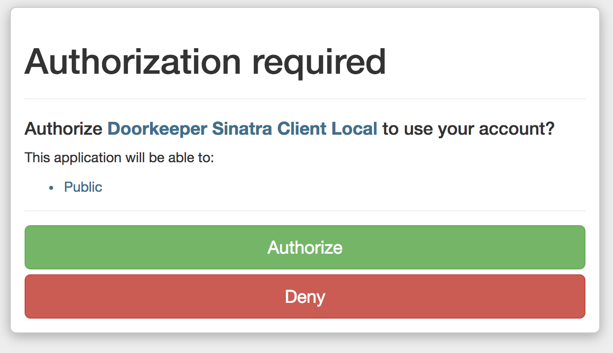

# Skip Authorization

Users using the Authorization Code Flow will see this screen after logging in:



Under some circumstances, you might want to let users skip the screen above and have [applications](../concepts/application.md) auto-approved \(for example, when dealing with a trusted application\).

This is possible via a configuration option `skip_authorization` which takes either `true` or `false`:



```ruby
skip_authorization do
  true
end
```



If you need more control over which application or user can skip the authorization, the resource owner and client will be available as block arguments:



```ruby
skip_authorization do |resource_owner, client|
  client.superapp? || resource_owner.admin?
end
```



